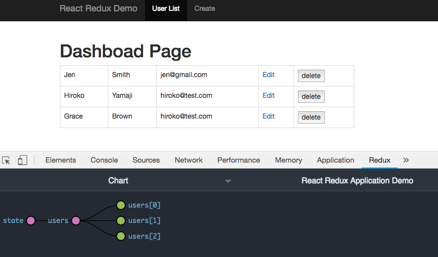
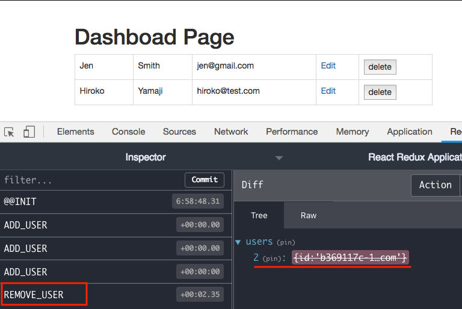
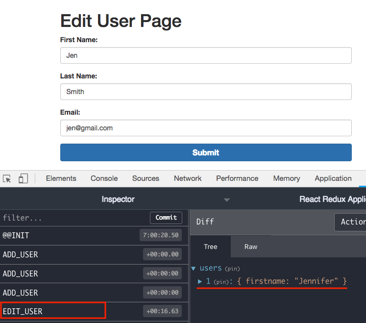

# Simple React-Redux application

## Live Demo:
https://safe-forest-29840.herokuapp.com/

## Create Redux state for users array
**demo state**
```js
const demoState = {
  users: [{
    id: 'poijasdfhwer',
    firstName: 'Smith',
    lastName: 'Brown',
    email: 'smith@test.com'
  }]
};
``` 

**1. Action generators for users state**
```js
src/actions/user.js
```

**2. Reducer for users state**
```js
src/actions/user.js
```

**3. Store**
```js
// src/store/configureStore.js
export default () => {
  const store = createStore(
    combineReducers({
      users: usersReducer,
    }),
    window.__REDUX_DEVTOOLS_EXTENSION__ && window.__REDUX_DEVTOOLS_EXTENSION__()
  );
  return store;
};
```

**4. Redux API - Provider component and Connect function**
- Provider
- Connect function
  
```js
import { Provider } from 'react-redux';

const jsx = (
  <Provider store={store}>
    <AppRouter />
  </Provider>
);
ReactDOM.render(jsx, document.getElementById('root'));
```

**Connect Function**
- Changed regular React component to connected component so that it is going to give us to access `props.dispatch()`.

```js
import {connect} from 'react-redux';
const UserListItem = ({dispatch, id, firstname, lastname, email}) =>{
  return (
      <button onClick={() =>{dispatch(removeUser({id}))}}>delete</button>
  )
}
//export default UserListItem;
export default connect()(UserListItem); // Connected Component
```

### How to use redux in React Component

**Rendering redux state**
```js
const UserList = (props) => {
  return (
    <Table bordered>
      <tbody>
      {
        props.users.map(user =>
          <UserListItem key={user.id} {...user}/>
          )
      }
      </tbody>
    </Table>
  )
};

const mapStateToProps = (state) => {
  return {
    users: state.users
  };
};
export default connect(mapStateToProps)(UserList);
```
<hr />

**Add redux state**
- `props.dispatch(addUser(user))`

```js
const AddUserPage = (props) => (
  <Grid>
    <Row>
      <Col xs={12} sm={10}>
        <h1>Create a new user</h1>
        <UserForm 
          onSubmit={(user) => {
          props.dispatch(addUser(user));
        }}/>      
      </Col>
    </Row>
  </Grid>
);
export default connect()(AddUserPage);
```

**Remove redux state**
```js
const UserListItem = ({dispatch, id, firstname, lastname, email}) =>{
  return (
      <tr>
        <td><Link to={`/edit/${id}`}>Edit</Link></td>
        <td><button onClick={() =>{dispatch(removeUser({id}))}}>delete</button></td>
      </tr>
  )
}
export default connect()(UserListItem);
```
<hr />


**Edit redux state**
```js
const EditUserPage = (props) => (
  <div>
    <UserForm 
      user={props.user}
      onSubmit={(user) => {
      props.dispatch(editUser(props.match.params.id, user));
      props.history.push('/');
    }}/>      
  </div>
);
const mapStateToProps = (state, props) => {
  return {
    user: state.users.find((user) => user.id === props.match.params.id)
  };
};
export default connect(mapStateToProps)(EditUserPage);
```


### Screenshot





## References:
- [Github-React-Redux](https://github.com/reduxjs/react-redux)